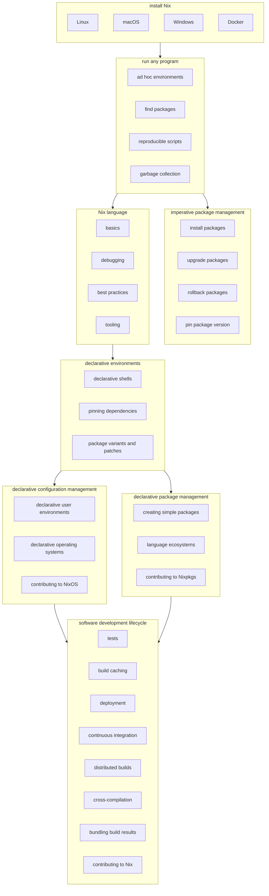

# Contributing to nix.dev

nix.dev is a community effort to collect, create, and maintain world-class learning resources for Nix.

It is supposed to fit between first impressions on the [Nix web site](https://nixos.org) and the reference manuals for [Nix][nix manual] ([source][nix manual src]), [Nixpkgs][nixpkgs manual] ([source][nixpkgs manual src]), and [NixOS][nixos manual] ([source][nixos manual src]).
See the [vision](#vision) and [textual outline](#outline) for an idea of a desired end state.

[nix manual]: https://nixos.org/manual/nix
[nix manual src]: https://github.com/NixOS/nix/tree/master/doc/manual
[nixpkgs manual]: https://nixos.org/manual/nixpkgs
[nixpkgs manual src]: https://github.com/NixOS/nixpkgs/tree/master/doc
[nixos manual]: https://nixos.org/manual/nixos
[nixos manual src]: https://github.com/NixOS/nixpkgs/tree/master/nixos/doc/manual

We strongly encourage everyone interested to contribute by asking informed questions or directly proposing changes.

Make a [pull request] if you want to introduce an incremental change.
Note our [considerations on licensing and attribution](#licensing-and-attribution).

Open an [issue] if you want to clarify something not evident from what is provided in this repository, or if you want to discuss a significant change before starting to work on it.

[issue]: https://github.com/NixOS/nix.dev/issues
[pull request]: https://github.com/NixOS/nix.dev/pulls

## What you can do

### You want to learn and use Nix?

This project would not be possible without you.
Try to use it as your primary resource, however incomplete it may appear.

We ask you to liberally open issues and document all problems and questions that arise.
Please also state your learning goals and the paths you have taken so far.

Sharing your first-hand experience is invaluable to better guide our efforts, and will immediately help improve these guides for yourself and everyone else.

### You have experience teaching Nix?

You will probably have observed where learners get stuck most often, and which typical needs and questions they have.
You may have your own written notes for classes, trainings, or presentations.

Please share your experience and help us inform the structure and detailed contents the guides.
It would be great if you could contribute examples, wordings, or illustrations that proved helpful to your students.

### You are a domain expert using Nix?

If you are proficient in applying Nix to a domain-specific problem, and want to share your expertise on best practices, please check the table of contents.
Does existing material on your subject meet your standards?
How could we improve it?
Is there a popular application of Nix' capabilities not yet covered?
We would be glad to incorporate your insights.

## Contributor guides

Please read ["Contributing Documentation"](./source/contributing/documentation.md).

# Vision

This is our vision for the journey into Nix, Nixpkgs, and NixOS.
We want to create and collect learning resources for mastering the ecosystem step by step.

Use it as a scaffold to to find a place for your ideas on new tutorials and guides.
It is still subject to change and refinement as we find out more about learners' needs, but already proved helpful for orienting beginners.

# Outline

See [Vision](#vision) for a graphical outline that illustrates the intended learning journey.

## Install Nix

Instructions for the various installation methods.

## Build and run software

Here we show how existing build plans are used to produce working software.

- Find packaged software
- Run software from existing packages
- Set up a temporary environment

The next chapter chapter is about how to hold onto the ephemeral examples from the previous chapter, and how to create more complex environments by composing existing packages.

## Imperative package management

Describes a straightforward transition from temporary environments using existing packages.

- Persist packages in the file system
- Updates, rollbacks, pinning
- Garbage collection

Imperative package management's unique feature is that it allows updating each package independently to the most recent available version without touching the rest of the system.

## Nix language

Leveraging the full power of Nix requires understanding the Nix language, and eventually learning to write Nix expressions.

- Syntax and semantics
  - Attribute sets
  - Functions
- Debugging
- Best practices
- Tooling
  - Syntax highlighting
  - Linters
  - Formatters

## Declarative environments

While imperative package management supports "generations", it does not have proper change management, "profiles" are not portable, and it is not immediately obvious how to compose packages into a larger unit.
This section shows how to have all of that by declaring a Nix expression in a file that can be used on any system that supports Nix.

- Declare a reproducible environment
- Pinning dependencies
- Adapt packages to your needs

## Declarative package management

Here we show how existing packages come into being, and how to modify and create packages.

- Modifying existing packages
- Creating new packages
- Language ecosystems
- Contribute to Nixpkgs

Creating packages and contributing are advanced topics that require much more detail (especially langauge specifics), and are partially covered in the Nixpkgs manual already.
In this context they are intended to demonstrate Nixpkgs architecture and design, to enable readers to navigate existing code, assess pull requests, and create or maintain their own packages.
This should be fairly superficial, otherwise it would duplicate much of the Nixpkgs manual.

Alternatively these sections could be dropped entirely, or moved to their own chapter and reference or reuse much of the Nixpkgs manual.
This is subject to refinement.

## Declarative configuration management

This section shows how the disconnected packages from previous examples can be wired up into a consistent and persistent user environment or operating system configuration.

- Declarative user environments with Home Manager
- Declarative operating systems with NixOS
- Contributing to NixOS

## Software development lifecycle

- Caching
- Deployment
- Continuous integration
- Distributed builds
- Cross-compilation
- Bundling build results
    - Virtual machines
    - Docker containers
- Contributing to Nix

# Licensing and attribution

When opening pull requests with your own contributions, you agree to licensing your work under [CC-BY-SA 4.0].
Before merging your work, you have to sign the [contributor agreement](cla/README.md).

Having a single legal entity hold non-exclusive copyright avoids disputes and ensures the material can be put to use more effectively, e.g. by eventually publishing it as a book.
You will still be considered co-author, as recorded by version history.

When adding material by third parties, make sure it has a matching license that permits this.
In that case, unambiguously state source, authors, and license.
Also [add the original author as co-author] to the respective change, so we can track authorship through version history.

Notify the authors *before* using their work.

[CC-BY-SA 4.0]: https://creativecommons.org/licenses/by-sa/4.0/
[add the original author as co-author]: https://docs.github.com/en/pull-requests/committing-changes-to-your-project/creating-and-editing-commits/creating-a-commit-with-multiple-authors

# Notes

## GitHub heading anchors fails linkcheck

Due to a [Sphinx bug][linkcheck gh bug], linkcheck fails when it verifies the
existence of GitHub heading anchors on rendered Markdown documents.

Until the bug is resolved, add the `user-content-` prefix to GitHub links
containing heading anchors.

For example, instead of
`https://github.com/cachix/install-nix-action#user-content-how-can-i-run-nixos-tests`,
use
`https://github.com/cachix/install-nix-action#user-content-how-can-i-run-nixos-tests`. 
