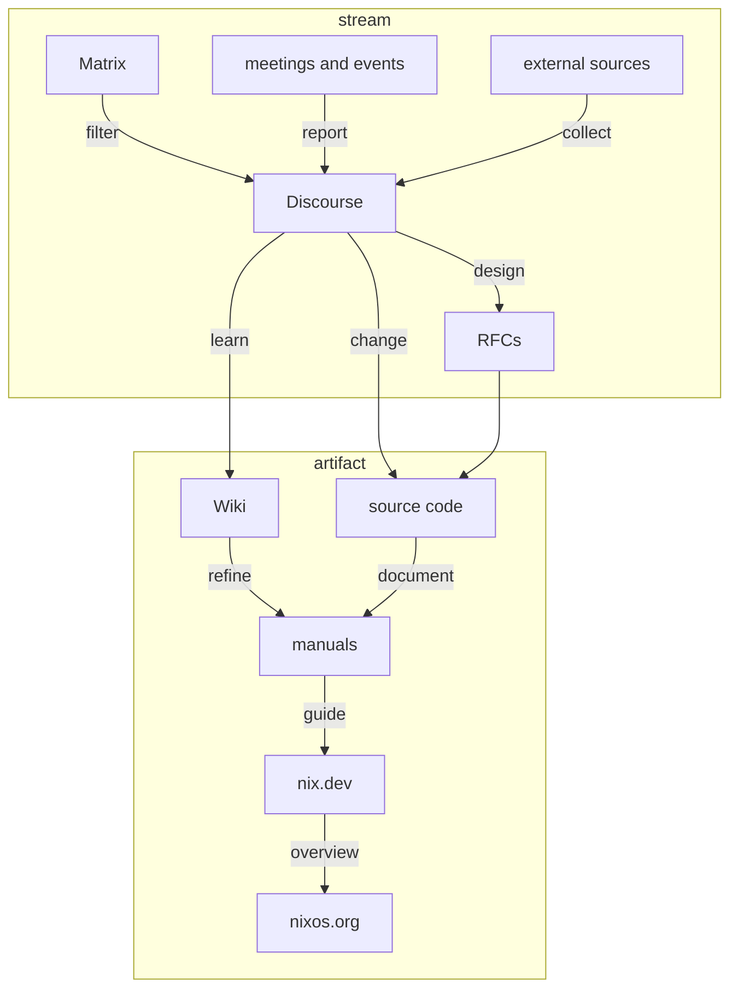

# How to contribute to documentation in the Nix ecosystem

If you want to help improving documentation, consider the following guidelines developed by the [Nix documentation team](./README.md).

Different audiences require different levels of sophistication, and both readers' and contributors' available time and expertise varies widely.

Use the following diagram to decide where to best put the results of your efforts, depending on how much time you can spend on refining them to get accepted.

The diagram shows a pipeline for contributions to learning materials and documentation.
Arrows point towards

- decreasing rate of change
- increasing public visibility
- increasing amount of scrutiny.

Communication platforms are distinguished by mode of interaction:

Streams can be appended to:

- The amount of infomation in them grows without bounds.
- Only recent items are relevant.

Artifacts can be changed:

- The amount of information in them is strictly bounded.
- All items should be up to date.

## Communication channels

- Matrix
    
  Use Matrix for casual communication.
  
  The documentation team frequents the [Nix\* Documentation](https://app.element.io/#/room/#docs:nixos.org) room.
  
  Old messages are extremely improbable to be read by anyone.

  You can help by posting in the appropriate categories on [Discourse](https://discourse.nixos.org/) what you have found valuable.
    
- meetings and events
    
  Check the [Discourse community calendar](https://discourse.nixos.org/t/community-calendar/18589) for real-time events.
  
  The documentation team holds regular meetings and posts meeting notes in the [Documentation](https://discourse.nixos.org/c/dev/documentation/25) category.
   
  You can help by joining meetings to take notes or clean them up before publishing.

- external sources
    
  The Internet is full of helpful resources concerning Nix.

  You can help by sharing in the [Links](https://discourse.nixos.org/c/links/12) category on Discourse what you have found valuable.
    
- Discourse
    
  [Discourse](https://discourse.nixos.org/) is the central community hub.
  This is the place for your questions, suggestions, and discussion.
  
  The documentation team monitors the [Documentation](https://discourse.nixos.org/c/dev/documentation/25) category.
  
  Old threads and especially posts in long threads are improbable to be read by many people.
  
  You can help by
  
  - asking informed questions, showing what you have done so far
  - answering other people's questions
  - writing down what you have learned by updating or adding a [NixOS Wiki](https://nixos.wiki/) article, nix.dev guide or tutorial, or one of the manuals
  - encouraging and helping people to incorporate their insights in the official documentation

- Wiki
    
  [NixOS Wiki](https://nixos.wiki/) is a collection of interlinked guides to solve common problems which are otherwise not well-documented.
  It is collectively edited by the community, covers a broad range of topics.
  It is only loosely organized, and does not impose quality standards.
  Its purpose is to quickly and conveniently collect insights and make them readily available for everyone.
    
  We recommend to use it as a dumping ground for more obscure Nix knowledge, and strive to make it *smaller* over time (see [NixCon 2015: Make Nix friendlier for Beginners](https://media.ccc.de/v/nixcon2015-3-MakeNixfriendlierforBeginners#video&t=1365)), by incrementally incorporating its contents into authoritative documentation and curated learning material.

  The documentation team monitors changes to maintain an overview of topics of interest and prevent vandalism.
  
  You can help with
  
  - improving discoverability by adding categorization and relevant links
  - clarifying articles and correcting errors
  - removing redundant information that is already present in curated sources
  - migrating information to other resources.
  
  Where to migrate what:
  
  - Nix interaction: [Nix manual](https://nixos.org/manual/nix/stable/)
  - Language-specific build instructions: [Nixpkgs manual](https://nixos.org/manual/nixpkgs/stable/)
  - Package, service, or hardware configuration: [NixOS manual](https://nixos.org/manual/nixos/stable/)
  - Overviews, tutorials, guides, and best practices: [nix.dev](https://nix.dev/)

- manuals
    
  The manuals for
  
  - [Nix](https://nixos.org/manual/nix/stable/) ([source](https://github.com/NixOS/nix/tree/master/doc/manual))
  - [Nixpkgs](https://nixos.org/manual/nixpkgs/stable/) ([source](https://github.com/NixOS/nixpkgs/tree/master/doc))
  - [NixOS](https://nixos.org/manual/nixos/stable/) ([source](https://github.com/NixOS/nixpkgs/tree/master/nixos/doc/manual))
  
  are purely reference documentation, specifying interfaces and behavior.
  They also show example interactions to show how to use its components, and explain mechanisms where necessary.
  
  The documentation team watches all pull requests to the manuals and assists contributors to get their changes merged.
  
  You can help by
    
  - working on [Nixpkgs and NixOS issues](https://github.com/NixOS/nixpkgs/issues?q=is%3Aopen+is%3Aissue+label%3A%229.needs%3A+documentation%22) or [Nix issues](https://github.com/NixOS/nix/issues?q=is%3Aopen+is%3Aissue+label%3Adocumentation) concerning documentation
  - reviewing [Nix pull requests](https://github.com/NixOS/nix/pulls?q=is%3Aopen+is%3Apr+label%3Adocumentation) and [Nixpkgs and NixOS pull requests](https://github.com/NixOS/nixpkgs/pulls?q=is%3Aopen+is%3Apr+label%3A%228.has%3A+documentation%22) concerning documentation
  - making pull requests to
    - add links to definitions, commands, options, etc. where only the name is mentioned
    - correct obvious errors
    - clarify language
  - expanding on sections that appear incomplete
  - documenting how the manuals are organized and built
  - identifying sections that are not reference documentation and should be moved to nix.dev

- nix.dev
    
  The purpose of [nix.dev](https://nix.dev/) ([source](https://github.com/nix-dot-dev/nix.dev)) is to guide newcomers by teaching essential Nix knowledge, show best practices, and help orient users in the Nix ecosystem.
  It goes into breadth, not depth.
  
  The documentation team maintains nix.dev as editors.
  
  You can help by
  
  - working on [open issues](https://github.com/nix-dot-dev/nix.dev/issues)
  - reviewing [pull requests](https://github.com/nix-dot-dev/nix.dev/pulls) by testing new material or features
  - adding guides or tutorials following the [proposed outline](https://github.com/nix-dot-dev/nix.dev/pull/265)
    - follow the [contribution guide](https://github.com/NixOS/nix.dev/blob/master/CONTRIBUTING.md)

  New articles can be based on videos such as
  - [The Nix Hour](https://www.youtube.com/watch?v=wwV1204mCtE&list=PLyzwHTVJlRc8yjlx4VR4LU5A5O44og9in) recordings
  - some of the ~100 [NixCon](https://www.youtube.com/c/NixCon) recordings
  - [Nix video guides](https://www.youtube.com/channel/UC-cY3DcYladGdFQWIKL90SQ) by @jonringer.
  - [Summer of Nix 2022 talks](https://www.youtube.com/playlist?list=PLt4-_lkyRrOMWyp5G-m_d1wtTcbBaOxZk)

  Since writing a guide or tutorial is a lot of work, please make sure to coordinate with nix.dev maintainers, for example by commenting on or opening an issue to make sure it will be worthwhile.
     

- [nixos.org](http://nixos.org/)
    
  The Nix project web site is [nixos.org](https://nixos.org/) ([source](https://github.com/NixOS/nixos-homepage)).
  Web site contents that concern learning Nix should reference or include material from nix.dev.
  
  The [Nix marketing team](https://nixos.org/community/teams/marketing.html) is responsible for the web site, and the documentation team assists with maintaining contents related to onboarding new users.

## Contributing to this guide

Do you have suggestions how to ease contributing to documentation in the Nix ecosystem?
Please open a pull request to update this document with your proposals.

## Links to this guide

In case this guide moves, the following documents link here and should be updated:

- [Discourse: Summer of Nix documentation stream](https://discourse.nixos.org/t/summer-of-nix-documentation-stream/20351)
- [Discourse: How to contribute to documentation](https://discourse.nixos.org/t/how-to-contribute-to-documentation/21028)
- [NixOS Wiki: Contributing to Nix documentation](https://nixos.wiki/wiki/Contributing_to_Nix_documentation)

