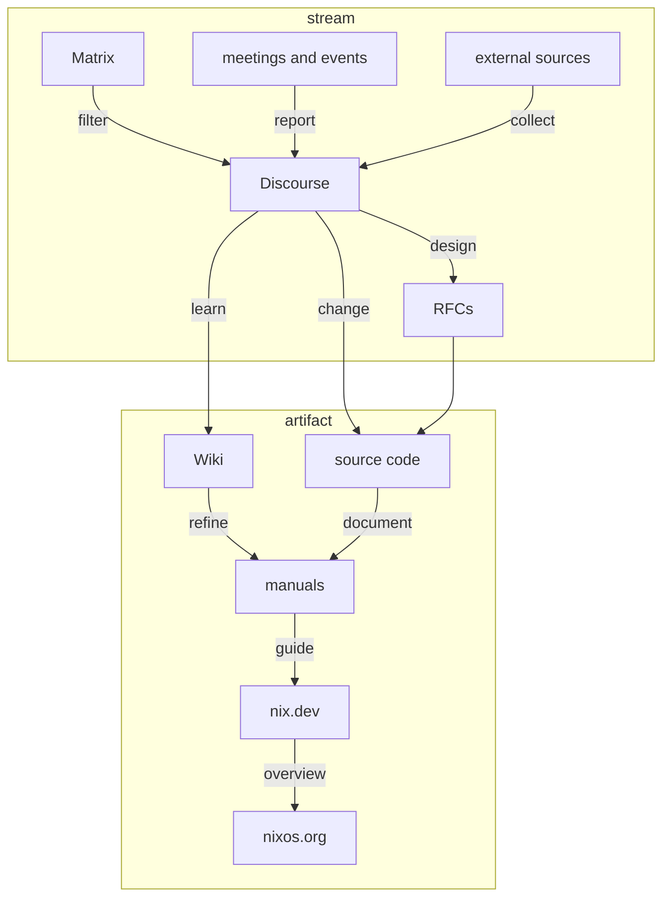

# How to contribute to documentation in the Nix ecosystem

If you want to help improving documentation, consider the following guidelines developed by the [Nix documentation team](./README.md).

Different audiences require different levels of sophistication, and both readers' and contributors' available time and expertise varies widely.

Use the following diagram to decide where to best put the results of your efforts, depending on how much time you can spend on refining them to get accepted.

The diagram shows a pipeline for contributions to learning materials and documentation.
Arrows point towards

- decreasing rate of change
- increasing public visibility
- increasing amount of scrutiny.

Communication platforms are distinguished by mode of interaction:

Streams can be appended to:

- The amount of infomation in them grows without bounds.
- Only recent items are relevant.

Artifacts can be changed:

- The amount of information in them is strictly bounded.
- All items should be up to date.

## Contributing to this guide

Do you have suggestions how to ease contributing to documentation in the Nix ecosystem?
Please open a pull request to update this document with your proposals.

## Links to this guide

In case this guide moves, the following documents link here and should be updated:

- [Discourse: Summer of Nix documentation stream](https://discourse.nixos.org/t/summer-of-nix-documentation-stream/20351)
- [Discourse: How to contribute to documentation](https://discourse.nixos.org/t/how-to-contribute-to-documentation/21028)
- [NixOS Wiki: Contributing to Nix documentation](https://nixos.wiki/wiki/Contributing_to_Nix_documentation)

