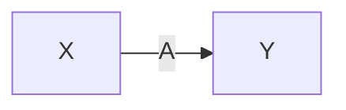
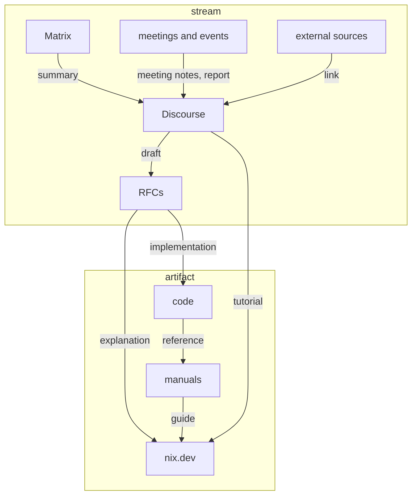

# Information flow in the Nix ecosystem

The diagram shows a simplified model of the information flow in the Nix ecosystem.
Its purpose is to make dependencies of the documentation types more explicit.
Note that it does not show issues and pull requests on GitHub, which host a wealth of ephemeral information.

Nodes are places or resources, edges denote an "informed by" relation, and edge labels are units of information.
Read the example as "A is informed by X and placed in Y":

Information resources – communication platforms – are distinguished by mode of interaction:

*Streams* can be appended to:

- The amount of information in them grows without bounds.
- Only recent items are relevant.

*Artifacts* can be changed:

- The amount of information in them is strictly bounded.
- All items should be up to date.

Arrows point roughly towards

- decreasing rate of change
- increasing public visibility
